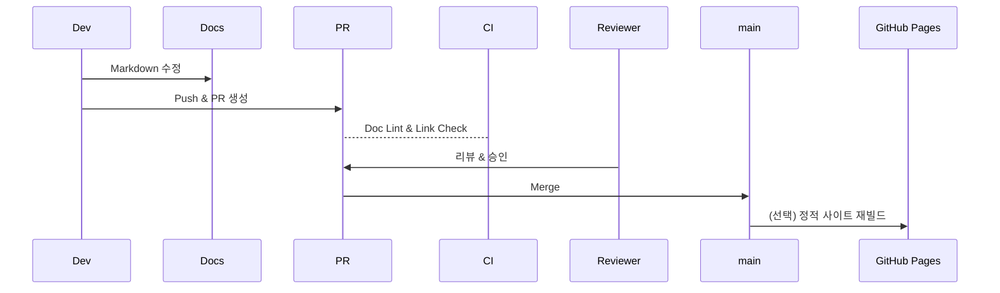

# 📚 Documentation Maintenance Guide

> 목적: 레포지토리의 **문서 품질** · **일관성** · **최신성**을 유지하여 개발/운영 속도를 높이고 지식 손실을 방지한다.

---
## 1. 문서 카테고리 & 책임자
| 카테고리 | 위치 | 주요 파일 | 책임(Owner) |
|-----------|-------|-----------|-------------|
| Ontology  | `docs/ontology_guide.md` `docs/queries/` | 객체·관계 정의 / Cypher 스니펫 | Data Architect |
| Lineage & ETL | `docs/lineage_and_etl.md` | DAG 설명 · Edge 패턴 | Data Engineer |
| Architecture | `docs/system_architecture.md` | 시스템/네트워크 도식 | Lead Dev |
| DevOps & CI | `README.md` Quick Start / `.github/workflows/` | 배포·테스트 | DevOps |
| Prompts & AI | `ai_resources/` | Codex·Cursor 프롬프트 | ML Engineer |
| Plans & Reports | `docs/project_plan.md` `docs/status_report.md` | 일정·성과 | PM |

---
## 2. 파일 네이밍 & 버전 규칙
1. **한글+영문 병기**: 가독성과 검색성을 위해 제목/표·주석은 한글, 코드·속성·경로는 영문 사용.  
2. **vN.N** 태그: 큰 구조 변경 시 상단 H1 옆 `(v2.0)` 식으로 명시.  
3. **역사 보존**: `/docs/archive/` 폴더에 구버전 문서를 이동(삭제 금지).

---
## 3. 자동화 툴
| 스크립트 | 설명 | 사용 시점 |
|-----------|------|-----------|
| `analysis/tools/update_docs.py` | 제목 아래 경고문 삽입 및 용어 일괄 치환 | 대규모 용어 변경 시 | 
| `generate_directory_listing.bat` | 실제 폴더 구조 → `docs/directory_structure.md` 자동 갱신 | 폴더 추가/이동 후 | 
| `scripts/generate_ge_suite.py` | CSV → GE Expectation Suite JSON | 새 데이터셋 도입 시 | 
| `scripts/ontology_refactor.py` | CSV 스키마 diff → Cypher 패치 생성·적용 | 온톨로지 변경 시 |

---
## 4. CI 체크리스트
GitHub Actions `ci.yml` 에서 다음을 검증한다.
- Markdown lint (`markdownlint-cli2`) – **TODO**: requirements에 추가
- Mermaid 플롯 렌더링 테스트 (Mermaid CLI) – 선택
- 링크 확인 (`lychee`) – Broken link 방지

> ✏️ 추가 예정: `docs/*.md` 변경 PR 에서는 위 lint 작업만 빠르게 실행하는 **docs-only** 워크플로.

---
## 5. 업데이트 프로세스

1. **작업 전** 최신 `main` 브랜치 pull.  
2. 문서 작성 후 `npm run md-lint` (로컬) or `pre-commit` hook으로 lint.  
3. PR 제목: `[docs] <섹션>: <변경 요약>`  
4. 리뷰어 최소 1인 승인 필요.  
5. Merge 후 CI가 통과해야 배포.

---
## 6. Mermaid 도식 삽입 지침

- 가로 폭 700px 이하로 유지 → GitHub 모바일 가독성 확보.  
- `flowchart LR` 기본, 복잡하면 `subgraph` 구간화.  
- 도식 파일은 `.md` 내 인라인, 또는 `docs/diagrams/*.mmd` 로 분리.

---
## 7. FAQ
**Q1. 대용량 도식 이미지는 어디에 보관하나요?**  
A. `docs/assets/` 폴더에 WebP 형식으로 저장 후 Markdown에 상대 경로 삽입.

**Q2. Codex CLI 로 문서도 생성 가능한가요?**  
A. 가능. `ai_resources/prompts/` 에 문서 생성용 프롬프트 템플릿을 추가하고, `codex run md "..."` 명령으로 자동화할 수 있습니다.

---
> [Directory Structure](directory_structure.md) 문서도 함께 참고하세요.

최근 업데이트: 2025-05-18  
> 작성: DevOps Guild 