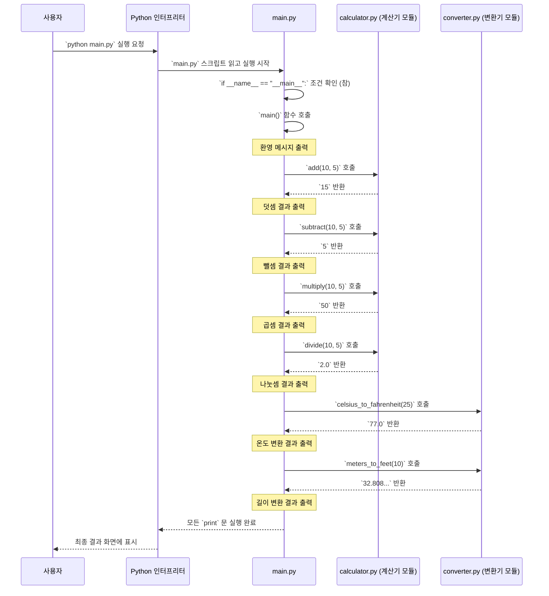

# Chapter 1: 애플리케이션 실행 및 시연


안녕하세요! `example_code` 프로젝트에 오신 것을 환영합니다. 이 튜토리얼 시리즈는 여러분이 파이썬으로 작성된 간단한 계산기와 단위 변환기 애플리케이션의 구조와 작동 방식을 이해하도록 돕기 위해 만들어졌습니다.

첫 번째 장에서는 전체 프로그램이 어떻게 시작되고, 우리가 만들 다양한 기능들이 실제로 어떻게 사용되는지 살펴보겠습니다. 마치 요리 레시피의 첫 페이지에서 완성된 요리 사진을 보여주며 무엇을 만들지 알려주는 것과 같아요!

## 무엇을 배우나요?

우리는 `main.py`라는 특별한 파일을 통해 애플리케이션을 실행하고, 그 결과를 직접 눈으로 확인할 것입니다. 이 파일은 우리 프로그램의 "정문"과 같아서, 모든 것이 여기서 시작됩니다.

일상생활에서 간단한 계산이 필요하거나, 온도를 섭씨에서 화씨로 바꿔야 할 때가 있죠? 이 프로그램은 바로 그런 기본적인 작업들을 수행합니다. `main.py` 파일은 이러한 계산기능과 단위 변환 기능이 어떻게 호출되고 사용되는지 보여주는 "시연장" 역할을 합니다.

`main.py` 파일은 마치 오케스트라의 지휘자와 같습니다. 지휘자가 각 악기(우리 프로그램에서는 '계산기 모듈', '단위 변환기 모듈')를 조화롭게 지휘하여 아름다운 음악(전체 프로그램 실행 결과)을 만들어내는 것처럼, `main` 함수는 각 기능들을 순서대로 실행하고 그 결과를 보여줍니다. 이를 통해 우리는 각 모듈의 함수들을 어떻게 호출하고 조합하는지 자연스럽게 배울 수 있으며, 프로그램의 전반적인 흐름을 파악하는 데 중요한 첫걸음을 내딛게 됩니다.

## 애플리케이션 실행해보기

먼저, 우리 애플리케이션이 실제로 어떻게 작동하는지 직접 실행해 봅시다. `main.py` 파일이 있는 디렉토리에서 터미널 또는 명령 프롬프트를 열고 다음 명령어를 입력하세요:

```bash
python main.py
```

이 명령어를 실행하면, 화면에 다음과 같은 결과가 나타날 것입니다:

```
Welcome to Simple Calculator App
10 + 5 = 15
10 - 5 = 5
10 * 5 = 50
10 / 5 = 2.0
25°C = 77.0°F
10m = 32.808_398_950_131_24ft
```

와! 간단한 계산 결과와 단위 변환 결과가 성공적으로 출력되었네요. 이제 이 출력이 어떻게 만들어졌는지 코드를 통해 자세히 살펴보겠습니다.

## `main.py` 코드 살펴보기

애플리케이션의 심장부인 `main.py` 파일의 코드를 함께 분석해 봅시다. 전체 코드는 다음과 같습니다:

```python
# --- File: main.py ---
"""
Example code for PocketFlow Tutorial Codebase Knowledge
"""

import calculator
import converter

def main():
    print("Welcome to Simple Calculator App")
    
    a = 10
    b = 5
    
    # Basic calculations (기본 계산)
    print(f"{a} + {b} = {calculator.add(a, b)}")
    print(f"{a} - {b} = {calculator.subtract(a, b)}")
    print(f"{a} * {b} = {calculator.multiply(a, b)}")
    print(f"{a} / {b} = {calculator.divide(a, b)}")
    
    # Temperature conversion (온도 변환)
    celsius = 25
    fahrenheit = converter.celsius_to_fahrenheit(celsius)
    print(f"{celsius}°C = {fahrenheit}°F")
    
    # Length conversion (길이 변환)
    meters = 10
    feet = converter.meters_to_feet(meters)
    print(f"{meters}m = {feet}ft")

if __name__ == "__main__":
    main()
```

이 코드를 작은 부분으로 나누어 하나씩 이해해 보겠습니다.

### 1. 모듈 가져오기 (Importing Modules)

```python
import calculator
import converter
```

*   `import calculator`: 이 줄은 `calculator.py` 파일에 있는 모든 기능을 가져와서 사용할 수 있게 해줍니다. `calculator`는 우리가 만든 [계산기 기능 모음](02_계산기_기능_모음_.md)입니다.
*   `import converter`: 비슷하게, 이 줄은 `converter.py` 파일의 기능을 가져옵니다. `converter`는 [단위 변환 기능 모음](04_단위_변환_기능_모음_.md)을 담고 있습니다.

마치 요리를 하기 위해 필요한 도구 상자(계산기, 변환기)를 작업대 위에 올려놓는 것과 같아요.

### 2. `main` 함수 정의

```python
def main():
    # 프로그램의 주요 로직이 여기에 들어갑니다.
    print("Welcome to Simple Calculator App")
    
    a = 10
    b = 5
```

*   `def main():`: 파이썬에서 함수를 정의할 때 사용하는 키워드입니다. `main`이라는 이름의 함수를 만드는 것이죠. 이 함수 안에 프로그램의 주요 실행 내용이 담깁니다.
*   `print("Welcome to Simple Calculator App")`: 화면에 환영 메시지를 출력합니다.
*   `a = 10`, `b = 5`: 계산에 사용할 숫자 `10`과 `5`를 각각 변수 `a`와 `b`에 저장합니다. 변수는 데이터를 담는 작은 상자라고 생각할 수 있습니다.

### 3. 기본 계산 수행

```python
    # Basic calculations (기본 계산)
    print(f"{a} + {b} = {calculator.add(a, b)}")
    print(f"{a} - {b} = {calculator.subtract(a, b)}")
    print(f"{a} * {b} = {calculator.multiply(a, b)}")
    print(f"{a} / {b} = {calculator.divide(a, b)}")
```

여기서는 앞에서 가져온 `calculator` 모듈의 함수들을 사용합니다. 각 함수는 [기본 산술 연산 함수](03_기본_산술_연산_함수_.md)에서 더 자세히 다룰 것입니다.

*   `calculator.add(a, b)`: `calculator` 모듈의 `add` 함수를 호출하여 `a`와 `b`를 더합니다. 결과는 `15`가 됩니다.
*   `calculator.subtract(a, b)`: `subtract` 함수를 호출하여 `a`에서 `b`를 <0xEB><0xB9><0xBD>니다. 결과는 `5`입니다.
*   `calculator.multiply(a, b)`: `multiply` 함수로 `a`와 `b`를 곱합니다. 결과는 `50`입니다.
*   `calculator.divide(a, b)`: `divide` 함수로 `a`를 `b`로 나눕니다. 결과는 `2.0`입니다.
*   `print(f"...")`: `f-string`이라는 파이썬 기능을 사용하여 변수 값과 문자열을 보기 좋게 조합하여 출력합니다. 예를 들어 `{a} + {b}`는 `10 + 5`로 표시됩니다.

### 4. 단위 변환 수행

```python
    # Temperature conversion (온도 변환)
    celsius = 25
    fahrenheit = converter.celsius_to_fahrenheit(celsius)
    print(f"{celsius}°C = {fahrenheit}°F")
```

이번에는 `converter` 모듈을 사용하여 온도를 변환합니다.

*   `celsius = 25`: 섭씨 온도를 변수 `celsius`에 저장합니다.
*   `converter.celsius_to_fahrenheit(celsius)`: `converter` 모듈의 `celsius_to_fahrenheit` 함수를 호출하여 섭씨 25도를 화씨로 변환합니다. 이 함수는 [온도 단위 변환 함수](05_온도_단위_변환_함수_.md)에서 자세히 설명합니다. 결과 `77.0`이 `fahrenheit` 변수에 저장됩니다.
*   `print(...)`: 변환된 결과를 출력합니다.

```python
    # Length conversion (길이 변환)
    meters = 10
    feet = converter.meters_to_feet(meters)
    print(f"{meters}m = {feet}ft")
```

길이 단위도 변환해 봅시다.

*   `meters = 10`: 길이 10미터를 변수 `meters`에 저장합니다.
*   `converter.meters_to_feet(meters)`: `converter` 모듈의 `meters_to_feet` 함수를 호출하여 10미터를 피트(feet)로 변환합니다. 이 함수는 [길이 단위 변환 함수](06_길이_단위_변환_함수_.md)에서 자세히 설명합니다. 결과 (약 `32.8`)가 `feet` 변수에 저장됩니다.
*   `print(...)`: 변환된 길이를 출력합니다.

### 5. 스크립트 실행의 시작점

```python
if __name__ == "__main__":
    main()
```

이 부분은 파이썬 스크립트가 직접 실행될 때 `main()` 함수를 호출하도록 하는 일반적인 방법입니다.

*   `__name__`: 파이썬 내부적으로 사용되는 특별한 변수입니다.
*   스크립트가 `python main.py`처럼 직접 실행되면, `__name__` 변수의 값은 `"__main__"`이 됩니다.
*   따라서 `if __name__ == "__main__":` 조건이 참(True)이 되어, 그 아래에 있는 `main()` 함수가 호출됩니다.

만약 이 파일이 다른 파일에서 `import` 되어 사용될 경우에는 `__name__` 값이 파일 이름(`main`)이 되므로, `main()` 함수가 자동으로 실행되지 않습니다. 이는 다른 모듈에서 이 파일의 함수만 가져다 쓰고 싶을 때 유용합니다.

## 프로그램은 어떻게 작동할까요? (내부 흐름)

우리가 `python main.py` 명령을 실행했을 때, 내부적으로 어떤 일들이 순서대로 일어나는지 간단한 그림으로 살펴봅시다.



이 다이어그램은 다음과 같은 과정을 보여줍니다:

1.  **사용자**가 `python main.py`를 실행합니다.
2.  **Python 인터프리터**가 `main.py` 파일을 실행합니다.
3.  `main.py` 내에서 `if __name__ == "__main__":` 조건이 만족되어 `main()` 함수가 호출됩니다.
4.  `main()` 함수는 순서대로 `print` 문을 실행하고, `calculator.py`와 `converter.py`에 정의된 함수들을 호출합니다.
5.  `calculator.py`와 `converter.py`의 함수들은 계산/변환 결과를 `main.py`로 반환합니다.
6.  `main.py`는 이 반환된 값들을 포함하여 최종 결과를 화면에 출력합니다.

`main.py`는 이렇게 여러 모듈의 기능들을 "지휘"하여 하나의 완성된 애플리케이션 흐름을 만들어내는 것입니다. 각 모듈 (`calculator.py`, `converter.py`)은 특정 기능에 집중하고, `main.py`는 이들을 필요에 맞게 가져와 사용하는 것이죠.

## 정리 및 다음 단계

이번 장에서는 `example_code` 애플리케이션의 시작점인 `main.py` 파일을 살펴보았습니다. `main` 함수가 어떻게 다른 모듈들(계산기, 단위 변환기)의 기능을 호출하여 사용하는지, 그리고 프로그램 전체가 어떻게 실행되어 결과를 보여주는지 이해했습니다.

이제 우리는 오케스트라의 전체 연주를 감상한 셈입니다. 다음 장부터는 각 악기들이 어떻게 소리를 내는지, 즉 각 모듈과 함수들이 구체적으로 어떻게 구성되어 있는지 자세히 알아볼 것입니다.

다음 장에서는 오늘 `main.py`에서 사용했던 `calculator` 모듈에 대해 더 깊이 탐구해보겠습니다.

➡️ [다음 장: 계산기 기능 모음](02_계산기_기능_모음_.md)

---

Generated by [AI Codebase Knowledge Builder](https://github.com/The-Pocket/Tutorial-Codebase-Knowledge)