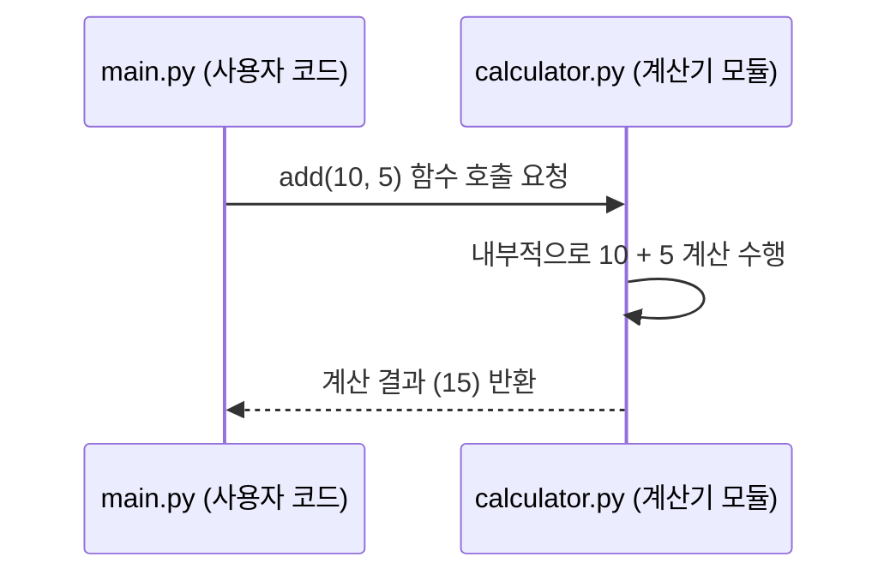

# Chapter 2: 계산기 기능 모음


안녕하세요! 이전 장인 [애플리케이션 실행 및 시연](01_애플리케이션_실행_및_시연_.md)에서는 `main.py` 파일을 통해 우리 프로그램 전체가 어떻게 동작하는지 간략하게 살펴보았습니다. 마치 영화 예고편처럼 앞으로 배울 기능들이 어떻게 사용되는지 맛보았죠.

이번 장에서는 그중에서도 핵심적인 부분인 "계산기 기능 모음"에 대해 자세히 알아보겠습니다.

## 계산기 기능 모음이란 무엇일까요?

일상생활에서 우리는 종종 간단한 계산이 필요합니다. 예를 들어, 친구들과 식사 비용을 나눠 내야 할 때, 장바구니에 담은 물건들의 총액을 계산할 때 등이 그렇죠. 만약 우리가 프로그래밍을 통해 이러한 계산을 해야 한다면 어떨까요? 매번 덧셈, 뺄셈, 곱셈, 나눗셈 코드를 처음부터 작성해야 할까요?

"계산기 기능 모음"은 바로 이런 불편함을 해결해 줍니다. 이것은 숫자들을 가지고 덧셈, 뺄셈, 곱셈, 나눗셈, 그리고 거듭제곱 같은 기본적인 수학 계산을 수행하는 함수들의 묶음입니다. 마치 주방의 다용도 칼 세트처럼, 다양한 요리(계산)에 필요한 도구(함수)들을 한데 모아 놓은 것과 같아요. 우리 프로젝트에서는 이 기능 모음이 `calculator.py`라는 파일 안에 담겨 있습니다.

이 모듈을 사용하면 코드 내에서 복잡한 계산 로직을 직접 작성할 필요 없이, 미리 만들어진 함수를 호출하여 간편하게 원하는 결과를 얻을 수 있습니다. 이는 코드의 가독성을 높이고 유지보수를 용이하게 만듭니다.

## 계산기 기능 모음 사용하기: `main.py` 예제 다시 보기

[애플리케이션 실행 및 시연](01_애플리케이션_실행_및_시연_.md)에서 `main.py` 파일을 실행했을 때, 여러 계산 결과가 출력되는 것을 보셨을 겁니다. 그 계산들이 바로 이 "계산기 기능 모음"을 사용한 결과입니다.

`main.py` 파일에서 계산기 기능을 사용하려면 먼저 `calculator` 모듈을 가져와야 합니다.

```python
# main.py 파일의 일부
import calculator
```

`import calculator` 라는 코드는 "이제부터 `calculator.py` 파일 안에 있는 도구(함수)들을 사용할 준비가 되었어!"라고 파이썬에게 알려주는 것과 같습니다. 마치 작업대에 공구함(`calculator`)을 올려두는 것과 비슷하죠.

가져온 후에는 다음과 같이 계산기 모듈 안의 함수들을 사용할 수 있습니다. 예를 들어, 10과 5를 더하는 경우입니다:

```python
# main.py 파일의 일부
a = 10
b = 5

# 덧셈 예시
합계 = calculator.add(a, b)
print(f"{a} + {b} = {합계}")
```

이 코드를 실행하면 화면에는 다음과 같이 출력됩니다:

```
10 + 5 = 15
```

여기서 `calculator.add(a, b)`는 "`calculator` 공구함에서 `add`라는 도구를 꺼내서, `a`와 `b`라는 재료를 가지고 작업을 해줘!"라는 의미입니다. `add` 함수는 덧셈 결과를 반환하고, 이 결과가 `합계` 변수에 저장됩니다.

`calculator` 모듈에는 덧셈(`add`) 외에도 다음과 같은 유용한 계산 함수들이 들어있습니다:
*   뺄셈 (`subtract`)
*   곱셈 (`multiply`)
*   나눗셈 (`divide`)
*   거듭제곱 (`power`)

이 각각의 함수들이 어떻게 작동하는지는 다음 장인 [기본 산술 연산 함수](03_기본_산술_연산_함수_.md)에서 아주 자세히 살펴볼 예정입니다.

## `calculator.py` 내부 살짝 엿보기

그렇다면 `calculator.py` 파일 안에는 실제로 어떤 코드가 들어있을까요? `calculator.add(10, 5)`를 호출하면 어떤 일이 일어나는 걸까요?

**단계별 흐름:**

1.  `main.py`에서 `calculator.add(10, 5)` 코드가 실행됩니다.
2.  파이썬은 `calculator`라는 이름으로 가져온 모듈(`calculator.py` 파일)을 찾습니다.
3.  `calculator.py` 파일 안에서 `add`라는 이름의 함수를 찾습니다.
4.  `add` 함수는 입력으로 받은 두 숫자 (여기서는 10과 5)를 사용합니다.
5.  `add` 함수 내부 로직에 따라 두 숫자의 덧셈을 수행합니다 (10 + 5 = 15).
6.  계산된 결과값(15)을 `main.py`로 돌려줍니다(반환합니다).
7.  `main.py`는 이 반환된 값을 받아 `합계` 변수에 저장하거나 출력 등에 사용합니다.

이 과정을 간단한 그림으로 표현하면 다음과 같습니다:



**`calculator.py` 파일의 `add` 함수 예시:**

실제 `calculator.py` 파일에는 `add` 함수가 다음과 같이 정의되어 있습니다.

```python
# --- File: calculator.py ---

def add(a, b):
    """두 숫자를 더하고 결과를 반환합니다."""
    return a + b
```

*   `def add(a, b):` : `add`라는 이름의 함수를 정의합니다. 이 함수는 `a`와 `b`라는 두 개의 입력값(매개변수)을 받습니다.
*   `"""두 숫자를 더하고 결과를 반환합니다."""`: 이 부분은 함수에 대한 설명(독스트링, docstring)입니다. 이 함수가 어떤 역할을 하는지 알려주죠.
*   `return a + b`: 입력받은 `a`와 `b`를 더한 후, 그 결과를 함수를 호출한 곳으로 돌려줍니다.

다른 계산 함수들(뺄셈, 곱셈 등)도 이와 비슷한 방식으로 `calculator.py` 파일 안에 정의되어 있습니다. 각 함수는 특정 계산을 수행하고 그 결과를 반환하는 "미니 프로그램"이라고 생각할 수 있습니다.

## 왜 "기능 모음" (모듈)으로 만들까요?

왜 이런 계산 함수들을 `calculator.py`라는 별도의 파일에 "모음"으로 만들어 놓았을까요?

*   **정리정돈**: 관련된 기능(계산 함수들)을 한 곳에 모아두면 코드가 훨씬 깔끔해지고 이해하기 쉬워집니다. 마치 연장통에 망치, 드라이버, 펜치 등을 종류별로 정리해두는 것과 같아요.
*   **재사용성**: 한번 만들어둔 계산 함수들은 `main.py` 뿐만 아니라 우리 프로그램의 다른 부분이나, 심지어 전혀 다른 프로젝트에서도 필요할 때마다 가져다 쓸 수 있습니다. 매번 같은 코드를 반복해서 작성할 필요가 없는 것이죠.
*   **유지보수 용이성**: 만약 덧셈 로직을 수정해야 하거나 개선해야 할 경우, `calculator.py` 파일의 `add` 함수만 보면 됩니다. 여러 곳에 흩어져 있는 코드를 찾아다닐 필요가 없어서 관리가 훨씬 편해집니다.

이렇게 기능들을 모듈로 묶는 것은 파이썬 프로그래밍에서 매우 흔하고 중요한 개념입니다. 프로그램을 더 체계적이고 효율적으로 만들어주기 때문입니다.

## 정리 및 다음 단계

이번 장에서는 "계산기 기능 모음"이 무엇인지, 왜 필요한지, 그리고 `main.py`에서 어떻게 사용하는지에 대해 알아보았습니다. `calculator.py` 파일이 다양한 수학 계산 함수들을 담고 있는 일종의 "도구 상자"와 같다는 것을 이해하셨을 겁니다.

우리는 `import` 키워드를 사용하여 이 도구 상자를 우리 코드에 가져오고, `모듈이름.함수이름()` 형태로 도구(함수)를 사용하는 방법을 배웠습니다.

이제 계산기 모음이라는 큰 그림을 보았으니, 다음 장에서는 이 모음 안에 있는 각각의 계산 함수들이 구체적으로 어떻게 만들어져 있고 어떻게 사용하는지 하나하나 자세히 파헤쳐 보겠습니다.

➡️ [다음 장: 기본 산술 연산 함수](03_기본_산술_연산_함수_.md)

---

Generated by [AI Codebase Knowledge Builder](https://github.com/The-Pocket/Tutorial-Codebase-Knowledge)