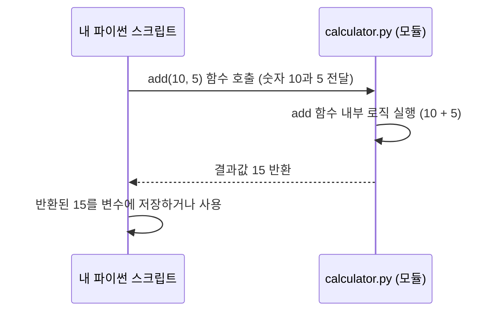

# Chapter 3: 기본 산술 연산 함수


안녕하세요! 이전 장인 [제2장: 계산기 기능 모음](02_계산기_기능_모음_.md)에서는 `calculator.py` 파일에 다양한 계산 기능들이 한데 모여 있다는 것을 배웠습니다. 마치 여러 도구가 들어있는 커다란 공구함과 같았죠.

이번 장에서는 그 공구함 안에 있는 가장 기본적인 도구들, 즉 **기본 산술 연산 함수**들에 대해 자세히 살펴보겠습니다. 이 함수들은 우리가 숫자를 가지고 덧셈, 뺄셈, 곱셈, 나눗셈을 할 수 있게 도와주는 핵심적인 역할을 합니다.

## 기본 산술 연산 함수란 무엇일까요?

우리가 학교에서 처음 수학을 배울 때 가장 먼저 접하는 것이 바로 더하기, 빼기, 곱하기, 나누기 같은 기본적인 계산이죠. 프로그래밍에서도 마찬가지입니다. 숫자를 다루는 프로그램이라면 이러한 기본 연산 기능은 필수적입니다.

**기본 산술 연산 함수**는 `calculator` 모듈 안에 미리 만들어져 있는, 이런 핵심적인 수학 연산을 각각 수행하는 함수들입니다. 각 함수는 하나의 특정 계산만을 전문적으로 처리합니다.

예를 들어, 여러분이 친구와 과자 값을 나눠 내야 한다고 상상해 보세요. 총 과자 값에서 인원수로 나누는 계산이 필요하겠죠? 이때 `calculator` 모듈의 나눗셈 함수를 사용하면 됩니다. 또는, 장바구니에 담은 물건들의 총액을 계산하고 싶다면 덧셈 함수를 여러 번 사용할 수 있습니다.

이 함수들은 마치 공구함 속의 개별 도구들과 같습니다. 십자드라이버는 나사를 조이거나 풀 때만 사용하고, 망치는 못을 박을 때만 사용하는 것처럼, `add` 함수는 더하기만, `divide` 함수는 나누기만 수행합니다. 이렇게 각자의 역할이 명확하기 때문에 우리는 필요에 따라 정확한 도구(함수)를 선택하여 쉽고 효율적으로 원하는 계산을 할 수 있습니다.

우리 `calculator.py` 파일에는 다음과 같은 기본 산술 연산 함수들이 준비되어 있습니다:

*   `add`: 두 숫자를 더합니다.
*   `subtract`: 한 숫자에서 다른 숫자를 <0xEB><0xB9><0xBD>니다.
*   `multiply`: 두 숫자를 곱합니다.
*   `divide`: 한 숫자를 다른 숫자로 나눕니다.

이제 각 함수를 어떻게 사용하고, 내부적으로 어떻게 동작하는지 하나씩 살펴보겠습니다.

## 1. 덧셈 함수: `add(a, b)`

가장 기본적인 연산인 덧셈부터 시작해 봅시다. `add` 함수는 두 개의 숫자를 입력받아 그 합을 반환합니다.

**사용 예시:**

만약 10과 5를 더하고 싶다면, 다음과 같이 `calculator` 모듈의 `add` 함수를 사용할 수 있습니다.

```python
import calculator

결과 = calculator.add(10, 5)
print(f"10 + 5 = {결과}")

다른_결과 = calculator.add(100, 200)
print(f"100 + 200 = {다른_결과}")
```

**출력 결과:**

```
10 + 5 = 15
100 + 200 = 300
```

*   `import calculator`: 먼저 `calculator` 모듈을 가져옵니다. 그래야 그 안의 함수들을 사용할 수 있습니다.
*   `결과 = calculator.add(10, 5)`: `calculator` 모듈 안에 있는 `add` 함수를 호출합니다. 괄호 안에 더하고 싶은 숫자 `10`과 `5`를 넣어줍니다. `add` 함수는 이 두 숫자를 더한 결과(15)를 `결과`라는 변수에 저장합니다.
*   `print(...)`: 결과를 화면에 예쁘게 출력합니다.

**`add` 함수 내부 모습 (`calculator.py`):**

`calculator.py` 파일 안에서 `add` 함수는 이렇게 생겼습니다.

```python
# --- File: calculator.py ---
# ... (다른 코드 생략) ...

def add(a, b):
    """두 숫자를 더하고 결과를 반환합니다."""
    return a + b

# ... (다른 코드 생략) ...
```

*   `def add(a, b):`: `add`라는 이름의 함수를 정의합니다. 이 함수는 `a`와 `b`라는 두 개의 입력값(매개변수)을 받도록 되어 있습니다.
*   `return a + b`: 입력받은 `a`와 `b`를 `+` 연산자로 더한 후, 그 결과를 함수를 호출한 곳으로 돌려줍니다(반환합니다). 정말 간단하죠?

## 2. 뺄셈 함수: `subtract(a, b)`

다음은 뺄셈입니다. `subtract` 함수는 첫 번째 숫자에서 두 번째 숫자를 뺀 결과를 반환합니다. 순서가 중요하니 주의하세요! `subtract(a, b)`는 `a - b`를 계산합니다.

**사용 예시:**

10에서 3을 빼는 계산은 다음과 같습니다.

```python
import calculator

결과 = calculator.subtract(10, 3)
print(f"10 - 3 = {결과}")

음수_결과 = calculator.subtract(5, 12)
print(f"5 - 12 = {음수_결과}")
```

**출력 결과:**

```
10 - 3 = 7
5 - 12 = -7
```

*   `결과 = calculator.subtract(10, 3)`: `calculator` 모듈의 `subtract` 함수에 `10`과 `3`을 전달하여 `10 - 3`을 계산하고, 그 결과인 `7`을 `결과` 변수에 저장합니다.

**`subtract` 함수 내부 모습 (`calculator.py`):**

```python
# --- File: calculator.py ---
# ... (다른 코드 생략) ...

def subtract(a, b):
    """a에서 b를 <0xEB><0xB9><0xBD> 결과를 반환합니다."""
    return a - b

# ... (다른 코드 생략) ...
```

*   `def subtract(a, b):`: `subtract` 함수는 `a`와 `b`를 입력받습니다.
*   `return a - b`: `a`에서 `b`를 뺀 결과를 반환합니다.

## 3. 곱셈 함수: `multiply(a, b)`

이제 곱셈 차례입니다. `multiply` 함수는 두 숫자를 곱한 결과를 반환합니다.

**사용 예시:**

7과 8을 곱해볼까요?

```python
import calculator

결과 = calculator.multiply(7, 8)
print(f"7 * 8 = {결과}")

소수_결과 = calculator.multiply(2.5, 4)
print(f"2.5 * 4 = {소수_결과}")
```

**출력 결과:**

```
7 * 8 = 56
2.5 * 4 = 10.0
```

*   `결과 = calculator.multiply(7, 8)`: `multiply` 함수를 사용하여 `7`과 `8`을 곱하고, 결과 `56`을 `결과` 변수에 저장합니다.
*   `multiply` 함수는 정수뿐만 아니라 소수(부동소수점 수)의 곱셈도 잘 처리합니다.

**`multiply` 함수 내부 모습 (`calculator.py`):**

```python
# --- File: calculator.py ---
# ... (다른 코드 생략) ...

def multiply(a, b):
    """두 숫자를 곱하고 결과를 반환합니다."""
    return a * b

# ... (다른 코드 생략) ...
```

*   `def multiply(a, b):`: `multiply` 함수는 `a`와 `b`를 입력받습니다.
*   `return a * b`: `a`와 `b`를 `*` 연산자로 곱한 결과를 반환합니다.

## 4. 나눗셈 함수: `divide(a, b)`

마지막 기본 산술 연산은 나눗셈입니다. `divide` 함수는 첫 번째 숫자를 두 번째 숫자로 나눈 결과를 반환합니다. `divide(a, b)`는 `a / b`를 계산합니다.

**사용 예시:**

10을 2로 나눠봅시다.

```python
import calculator

결과 = calculator.divide(10, 2)
print(f"10 / 2 = {결과}")

소수_나눗셈_결과 = calculator.divide(7, 2)
print(f"7 / 2 = {소수_나눗셈_결과}")
```

**출력 결과:**

```
10 / 2 = 5.0
7 / 2 = 3.5
```

*   `결과 = calculator.divide(10, 2)`: `divide` 함수를 사용하여 `10`을 `2`로 나누고, 결과 `5.0`을 `결과` 변수에 저장합니다.
*   파이썬에서 `/` 연산자를 사용한 나눗셈은 항상 소수점까지 표현되는 결과(부동소수점 수)를 반환합니다. 그래서 `10 / 2`의 결과가 정수 `5`가 아닌 `5.0`으로 나옵니다.

**나눗셈의 특별한 경우: 0으로 나누기**

수학에서 어떤 숫자를 0으로 나누는 것은 허용되지 않습니다. 프로그램에서도 마찬가지입니다. `divide` 함수는 이 경우를 특별히 처리합니다. 만약 두 번째 숫자로 `0`이 들어오면, "0으로 나눌 수 없습니다 (Cannot divide by zero)"라는 `ValueError` 오류를 발생시킵니다.

```python
import calculator

try:
    결과 = calculator.divide(10, 0)
    print(f"10 / 0 = {결과}")
except ValueError as e:
    print(f"오류 발생: {e}")
```

**출력 결과:**

```
오류 발생: Cannot divide by zero
```

*   `try...except ValueError as e:`: 이 부분은 오류를 처리하는 코드입니다. `try` 블록 안의 코드를 실행하다가 `ValueError`가 발생하면, 프로그램이 멈추는 대신 `except` 블록 안의 코드가 실행됩니다.
*   `calculator.divide(10, 0)`을 시도하면 `ValueError`가 발생하고, `e`라는 변수에 오류 메시지가 담깁니다.
*   `print(f"오류 발생: {e}")`는 "오류 발생: Cannot divide by zero"를 출력합니다.

**`divide` 함수 내부 모습 (`calculator.py`):**

```python
# --- File: calculator.py ---
# ... (다른 코드 생략) ...

def divide(a, b):
    """a를 b로 나누고 결과를 반환합니다.
    
    b가 0이면 ValueError를 발생시킵니다.
    """
    if b == 0:
        raise ValueError("Cannot divide by zero")
    return a / b

# ... (다른 코드 생략) ...
```

*   `if b == 0:`: 먼저 두 번째 입력값 `b`가 `0`인지 확인합니다.
*   `raise ValueError("Cannot divide by zero")`: 만약 `b`가 `0`이라면, `ValueError`를 발생시켜 오류가 났음을 알립니다. `raise`는 의도적으로 오류를 일으키는 명령어입니다.
*   `return a / b`: `b`가 `0`이 아니라면, `a`를 `b`로 나눈 결과를 반환합니다.

## 함수 호출 흐름 간단히 보기

우리가 `calculator.add(10, 5)`와 같이 함수를 호출하면 내부적으로 어떤 일이 일어날까요? 간단한 그림으로 표현하면 다음과 같습니다.



1.  **내 파이썬 스크립트** (예: `main.py` 또는 여러분이 작성 중인 다른 `.py` 파일)에서 `calculator.add(10, 5)`를 실행합니다.
2.  파이썬은 `calculator` 모듈(`calculator.py` 파일)에서 `add` 함수를 찾습니다.
3.  `add` 함수는 전달받은 `10`과 `5`를 가지고 `10 + 5` 계산을 수행합니다.
4.  계산 결과인 `15`를 **내 파이썬 스크립트**로 돌려줍니다(반환).
5.  **내 파이썬 스크립트**는 이 `15`라는 값을 받아서 변수에 저장하거나, 화면에 출력하는 등 다음 작업을 수행합니다.

다른 산술 연산 함수들(`subtract`, `multiply`, `divide`)도 비슷한 방식으로 작동합니다. 각자 맡은 계산을 수행하고 그 결과를 돌려주는 것이죠.

## 왜 각 연산마다 함수가 따로 있을까요?

왜 덧셈, 뺄셈, 곱셈, 나눗셈을 각각 별도의 함수로 만들었을까요? 한 함수에서 모든 것을 처리하게 할 수도 있지 않았을까요?

*   **명확성**: 각 함수는 딱 한 가지 일만 합니다. `add`는 더하기만, `subtract`는 빼기만 합니다. 이렇게 하면 함수 이름만 봐도 어떤 기능을 하는지 명확히 알 수 있습니다.
*   **단순성**: 각 함수는 자신의 역할에만 집중하기 때문에 내부 코드가 단순하고 이해하기 쉽습니다. 하나의 함수가 너무 많은 일을 하면 코드가 복잡해지고 오류가 발생하기 쉽습니다.
*   **재사용성**: 덧셈이 필요하면 `add` 함수를, 나눗셈이 필요하면 `divide` 함수를 가져다 쓰면 됩니다. 필요한 기능만 골라서 사용할 수 있어 편리합니다.

이는 마치 공구함의 도구들이 각자 고유한 용도를 가지는 것과 같습니다. 못을 박을 때는 망치를 쓰고, 나사를 조일 때는 드라이버를 쓰는 것처럼 말이죠. 각 도구는 자신의 역할에 최적화되어 있어 작업을 효율적으로 수행할 수 있도록 도와줍니다.

## 정리 및 다음 단계

이번 장에서는 `calculator` 모듈의 핵심 기능인 **기본 산술 연산 함수**들에 대해 배웠습니다.

*   `add(a, b)`: 두 숫자를 더합니다.
*   `subtract(a, b)`: 첫 번째 숫자에서 두 번째 숫자를 <0xEB><0xB9><0xBD>니다.
*   `multiply(a, b)`: 두 숫자를 곱합니다.
*   `divide(a, b)`: 첫 번째 숫자를 두 번째 숫자로 나눕니다 (0으로 나누면 오류 발생).

각 함수가 어떤 역할을 하는지, 어떻게 사용하는지, 그리고 내부적으로 어떻게 간단하게 구현되어 있는지 살펴보았습니다. 이제 여러분은 이 함수들을 사용하여 다양한 숫자 계산을 프로그래밍으로 처리할 수 있게 되었습니다!

지금까지 우리는 `calculator` 모듈의 기능들을 살펴보았습니다. 다음 장에서는 우리 프로젝트의 또 다른 중요한 기능 모음인 [제4장: 단위 변환 기능 모음](04_단위_변환_기능_모음_.md)에 대해 알아볼 것입니다. 온도나 길이를 다른 단위로 변환하는 흥미로운 기능들이 기다리고 있답니다!

➡️ [다음 장: 단위 변환 기능 모음](04_단위_변환_기능_모음_.md)

---

Generated by [AI Codebase Knowledge Builder](https://github.com/The-Pocket/Tutorial-Codebase-Knowledge)