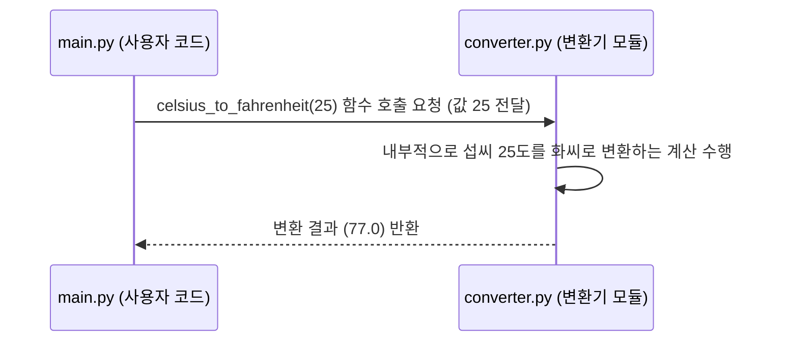

# Chapter 4: 단위 변환 기능 모음


안녕하세요! 이전 장인 [제3장: 기본 산술 연산 함수](03_기본_산술_연산_함수_.md)에서는 `calculator.py` 파일 안에 있는 덧셈, 뺄셈, 곱셈, 나눗셈과 같은 기본적인 계산 기능들에 대해 배웠습니다. 이 함수들이 어떻게 숫자를 다루는지 살펴보았죠.

이번 장에서는 우리 프로젝트의 또 다른 중요한 부분인 "단위 변환 기능 모음"에 대해 알아볼 시간입니다. 계산만큼이나 일상생활이나 프로그래밍에서 자주 필요한 것이 바로 단위를 바꾸는 일이니까요!

## 단위 변환 기능 모음이란 무엇일까요?

해외여행을 가서 현지 날씨 예보를 봤는데 온도가 화씨(°F)로 표시되어 있다면, 우리가 익숙한 섭씨(°C)로는 얼마쯤 되는지 궁금할 때가 있죠? 또는, 해외 직구 사이트에서 마음에 드는 옷을 발견했는데, 길이가 인치(inch)나 피트(feet)로 나와 있어서 센티미터(cm)나 미터(m)로 바꿔보고 싶을 수도 있습니다.

**단위 변환 기능 모음**은 바로 이런 상황에서 우리를 도와주는 유용한 도구 상자입니다. 이 모음은 `converter.py`라는 파일 안에 온도, 길이, 무게 등 다양한 측정 단위를 서로 변환해주는 함수들을 모아놓은 것입니다. 예를 들어, 섭씨 온도를 화씨로, 또는 미터를 피트로 변환하는 작업을 손쉽게 수행할 수 있게 해줍니다.

마치 여러 나라의 화폐를 환전해주는 은행 창구처럼, 이 기능 모음은 서로 다른 단위 체계 사이를 쉽게 오갈 수 있도록 도와줍니다. 이를 통해 국제적인 데이터를 다루거나 다양한 단위가 사용되는 상황에서 혼란 없이 정보를 이해하고 활용할 수 있습니다. 예를 들어, 과학 실험 데이터를 분석하거나, 여러 국가의 표준을 따라야 하는 제품을 개발할 때 매우 유용하게 사용될 수 있습니다.

우리 `converter.py` 파일에는 다음과 같은 종류의 단위 변환 함수들이 들어갈 예정입니다.
*   온도 변환 (예: 섭씨 ↔ 화씨)
*   길이 변환 (예: 미터 ↔ 피트)
*   무게 변환 (예: 킬로그램 ↔ 파운드)

이 장에서는 `converter.py` 모듈 전체의 개념과 사용법을 소개하고, 다음 장들에서 각 단위 변환 함수들을 자세히 살펴볼 것입니다.

## 단위 변환 기능 사용하기: `main.py` 예제 다시 보기

[제1장: 애플리케이션 실행 및 시연](01_애플리케이션_실행_및_시연_.md)에서 `main.py` 파일을 실행했을 때, 온도와 길이가 변환되어 출력되는 것을 기억하시나요? 그 변환 작업이 바로 이 "단위 변환 기능 모음"을 사용한 결과입니다.

`main.py` 파일에서 단위 변환 기능을 사용하려면, 먼저 `calculator` 모듈을 사용했을 때와 마찬가지로 `converter` 모듈을 가져와야 합니다.

```python
# main.py 파일의 일부
import converter
```

`import converter`라는 코드는 "이제부터 `converter.py` 파일 안에 있는 단위 변환 도구(함수)들을 사용할 준비가 되었어!"라고 파이썬에게 알려주는 신호입니다. 마치 작업대에 단위 변환에 필요한 특별한 자(converter)를 올려두는 것과 같아요.

모듈을 가져온 후에는 다음과 같이 `converter` 모듈 안의 함수들을 사용하여 단위를 변환할 수 있습니다.

**예시 1: 섭씨 온도를 화씨 온도로 변환하기**

```python
# main.py 파일의 일부
섭씨온도 = 25
화씨온도 = converter.celsius_to_fahrenheit(섭씨온도) # converter 모듈의 함수 사용
print(f"{섭씨온도}°C = {화씨온도}°F")
```

이 코드가 실행되면 화면에는 다음과 같이 출력됩니다:

```
25°C = 77.0°F
```

여기서 `converter.celsius_to_fahrenheit(섭씨온도)`는 "`converter` 도구 상자에서 `celsius_to_fahrenheit`라는 도구를 꺼내서, `섭씨온도`라는 값을 가지고 작업을 해줘!"라는 의미입니다. 이 함수는 섭씨를 화씨로 변환한 결과를 반환하고, 이 결과가 `화씨온도` 변수에 저장됩니다. `celsius_to_fahrenheit` 함수에 대한 자세한 내용은 [제5장: 온도 단위 변환 함수](05_온도_단위_변환_함수_.md)에서 다룰 예정입니다.

**예시 2: 미터(m)를 피트(ft)로 변환하기**

```python
# main.py 파일의 일부
미터 = 10
피트 = converter.meters_to_feet(미터) # converter 모듈의 함수 사용
print(f"{미터}m = {피트}ft")
```

실행 결과는 다음과 같습니다:

```
10m = 32.80839895013124ft
```

`converter.meters_to_feet(미터)` 역시 `converter` 모듈의 `meters_to_feet` 함수를 호출하여 미터 단위를 피트 단위로 변환합니다. 이 함수에 대한 자세한 내용은 [제6장: 길이 단위 변환 함수](06_길이_단위_변환_함수_.md)에서 배울 것입니다.

이처럼 `converter` 모듈은 다양한 단위 변환 함수들을 제공하여, 필요할 때마다 간편하게 호출하여 사용할 수 있도록 해줍니다.

## `converter.py` 내부 살짝 엿보기

그렇다면 `converter.py` 파일 안에는 실제로 어떤 코드가 들어있고, 우리가 `converter.celsius_to_fahrenheit(25)`와 같은 코드를 실행하면 어떤 일이 일어나는 걸까요?

**단계별 흐름:**

1.  `main.py` (또는 다른 파이썬 파일)에서 `converter.celsius_to_fahrenheit(25)` 코드가 실행됩니다.
2.  파이썬은 `converter`라는 이름으로 가져온 모듈(`converter.py` 파일)을 찾습니다.
3.  `converter.py` 파일 안에서 `celsius_to_fahrenheit`라는 이름의 함수를 찾습니다.
4.  `celsius_to_fahrenheit` 함수는 입력으로 받은 값 (여기서는 25)을 사용합니다.
5.  함수 내부에 정의된 계산식 (섭씨를 화씨로 바꾸는 공식)에 따라 변환을 수행합니다.
6.  계산된 결과값 (여기서는 77.0)을 `main.py`로 돌려줍니다 (반환합니다).
7.  `main.py`는 이 반환된 값을 받아 `화씨온도` 변수에 저장하거나 화면에 출력하는 등 다음 작업을 수행합니다.

이 과정을 간단한 그림으로 표현하면 다음과 같습니다:



**`converter.py` 파일의 함수 예시:**

실제로 `converter.py` 파일에는 섭씨를 화씨로 변환하는 `celsius_to_fahrenheit` 함수가 다음과 같이 정의되어 있습니다.

```python
# --- File: converter.py ---

def celsius_to_fahrenheit(celsius):
    """섭씨 온도를 화씨 온도로 변환합니다."""
    return (celsius * 9/5) + 32

# ... (다른 단위 변환 함수들이 여기에 정의됩니다) ...
# def meters_to_feet(meters):
#     """미터를 피트로 변환합니다."""
#     return meters * 3.28084
# ... 등등
```

*   `def celsius_to_fahrenheit(celsius):` : `celsius_to_fahrenheit`라는 이름의 함수를 정의합니다. 이 함수는 `celsius`라는 하나의 입력값(매개변수)을 받습니다. 이 `celsius` 변수에는 우리가 변환하고 싶은 섭씨 온도 값이 들어오게 됩니다.
*   `"""섭씨 온도를 화씨 온도로 변환합니다."""`: 이 부분은 함수에 대한 설명(독스트링, docstring)입니다. 이 함수가 어떤 역할을 하는지, 어떤 값을 입력받고 어떤 결과를 반환하는지 등을 설명해줍니다.
*   `return (celsius * 9/5) + 32`: 이 부분이 실제 변환 작업을 하는 핵심 코드입니다. 입력받은 `celsius` 값에 `9/5`를 곱하고 `32`를 더하는 섭씨-화씨 변환 공식을 계산하여, 그 결과를 함수를 호출한 곳으로 돌려줍니다.

다른 단위 변환 함수들(예: `meters_to_feet`, `kilograms_to_pounds` 등)도 이와 비슷한 방식으로 `converter.py` 파일 안에 각자의 변환 공식을 가지고 정의될 것입니다. 각 함수는 특정 단위 변환을 수행하고 그 결과를 반환하는 "작은 변환 전문가"라고 생각할 수 있습니다.

## 왜 "기능 모음" (모듈)으로 만들까요?

왜 이런 단위 변환 함수들을 `converter.py`라는 별도의 파일에 "모음"으로 만들어 놓았을까요? 이는 [제2장: 계산기 기능 모음](02_계산기_기능_모음_.md)에서 `calculator.py` 모듈을 만든 이유와 매우 유사합니다.

*   **정리정돈 (Organization)**: 관련된 기능(단위 변환 함수들)을 한 곳에 모아두면 코드가 훨씬 깔끔해지고 이해하기 쉬워집니다. 마치 여러 종류의 환전 창구를 한 은행에 모아둔 것처럼, 단위 변환 관련 기능은 `converter.py` 파일만 찾아보면 됩니다.
*   **재사용성 (Reusability)**: 한번 만들어둔 단위 변환 함수들은 `main.py` 뿐만 아니라 우리 프로그램의 다른 부분이나, 심지어 전혀 다른 프로젝트에서도 필요할 때마다 `import converter` 한 줄로 간편하게 가져다 쓸 수 있습니다. 매번 섭씨-화씨 변환 공식을 새로 작성할 필요가 없는 것이죠.
*   **유지보수 용이성 (Maintainability)**: 만약 섭씨-화씨 변환 공식이 변경되거나 (그럴 일은 거의 없겠지만요!), 혹은 더 정확한 변환 상수를 사용해야 할 경우, `converter.py` 파일의 해당 함수만 수정하면 됩니다. 여러 곳에 흩어져 있는 코드를 일일이 찾아다니며 수정할 필요가 없어서 관리가 훨씬 편해집니다.

이렇게 기능들을 목적에 맞게 모듈로 묶는 것은 파이썬 프로그래밍을 더 체계적이고 효율적으로 만들어주는 매우 중요한 방법입니다. `calculator.py`가 계산 도구함이었다면, `converter.py`는 단위 변환 도구함인 셈이죠!

## 정리 및 다음 단계

이번 장에서는 "단위 변환 기능 모음"이 무엇인지, 왜 필요한지, 그리고 `main.py`에서 어떻게 `converter` 모듈을 가져와 사용하는지에 대해 알아보았습니다. `converter.py` 파일이 온도, 길이, 무게 등 다양한 단위를 변환하는 함수들을 담고 있는 일종의 "만능 환전소" 또는 "단위 변환 전문 도구 상자"와 같다는 것을 이해하셨을 겁니다.

우리는 `import` 키워드를 사용하여 이 변환 도구 상자를 우리 코드에 가져오고, `모듈이름.함수이름()` 형태로 필요한 변환 도구(함수)를 사용하는 방법을 배웠습니다.

이제 단위 변환 모음이라는 큰 그림을 보았으니, 다음 장부터는 이 모음 안에 있는 각각의 단위 변환 함수들이 구체적으로 어떻게 만들어져 있고 어떻게 사용하는지 하나하나 자세히 파헤쳐 보겠습니다. 가장 먼저, 우리에게 친숙한 온도를 변환하는 함수들을 살펴볼 예정입니다.

➡️ [다음 장: 온도 단위 변환 함수](05_온도_단위_변환_함수_.md)

---

Generated by [AI Codebase Knowledge Builder](https://github.com/The-Pocket/Tutorial-Codebase-Knowledge)