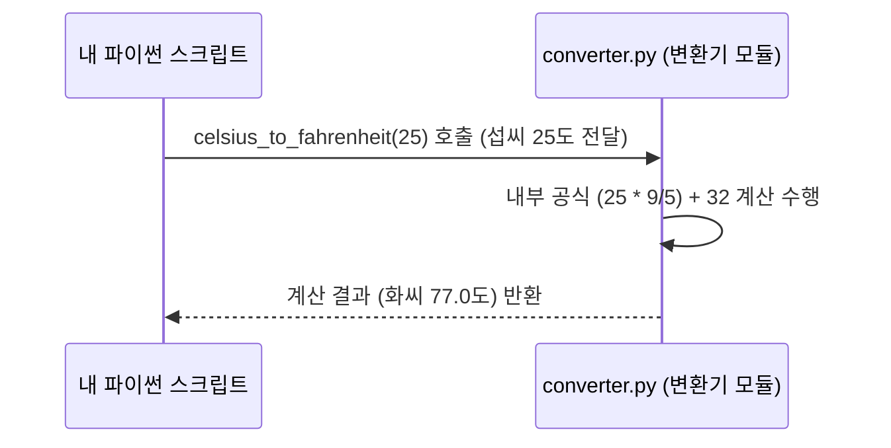

# Chapter 5: 온도 단위 변환 함수


안녕하세요! 이전 장인 [제4장: 단위 변환 기능 모음](04_단위_변환_기능_모음_.md)에서는 `converter.py`라는 파일에 온도, 길이, 무게 등 다양한 단위를 서로 바꿔주는 편리한 함수들이 모여 있다는 것을 배웠습니다. 마치 만능 환전소처럼요!

이번 장에서는 그중에서도 우리에게 가장 친숙한 **온도 단위를 변환하는 함수**들에 대해 자세히 알아보겠습니다. 해외 날씨 정보를 보거나, 외국 요리 레시피를 따라 할 때, 혹은 과학 실험에서 특정 온도 단위가 필요할 때가 있죠? 이럴 때 섭씨(Celsius, °C)와 화씨(Fahrenheit, °F)를 서로 바꿔야 하는 경우가 생깁니다. 바로 이럴 때 우리 `converter` 모듈의 온도 변환 함수들이 아주 유용하게 사용될 수 있습니다!

이 함수들은 마치 **양면으로 다른 단위를 보여주는 특별한 온도계**와 같아요. 한쪽 면에는 섭씨가, 다른 쪽 면에는 화씨가 적혀 있어서, 어느 쪽으로든 온도를 쉽게 읽을 수 있게 해주는 거죠.

## 온도를 변환하는 두 명의 전문가: `celsius_to_fahrenheit`와 `fahrenheit_to_celsius`

우리 `converter` 모듈 안에는 온도를 변환하는 두 가지 주요 함수가 있습니다.

1.  `celsius_to_fahrenheit(섭씨온도)`: 섭씨 온도를 화씨 온도로 바꿔줍니다.
2.  `fahrenheit_to_celsius(화씨온도)`: 화씨 온도를 섭씨 온도로 바꿔줍니다.

이름만 봐도 어떤 일을 하는지 명확하게 알 수 있죠? 이제 각 함수를 어떻게 사용하는지 함께 살펴봅시다.

## 온도 변환 함수 사용법

먼저, `converter` 모듈을 우리 코드에서 사용하려면 `import` 문을 사용해야 합니다.

```python
import converter # converter.py 파일의 모든 함수를 사용할 준비!
```

### 1. 섭씨(°C)를 화씨(°F)로 바꾸기: `celsius_to_fahrenheit()`

여름철 뉴스에서 "오늘 서울의 낮 최고 기온은 30°C입니다."라는 예보를 봤다고 합시다. 미국에 있는 친구에게 이 더위를 설명해주고 싶은데, 친구는 화씨에 더 익숙하다면 어떻게 해야 할까요? 이럴 때 `celsius_to_fahrenheit()` 함수를 사용하면 됩니다.

**사용 예시:**

섭씨 25도를 화씨로 바꿔봅시다.

```python
import converter

섭씨_온도 = 25
화씨_결과 = converter.celsius_to_fahrenheit(섭씨_온도)

print(f"{섭씨_온도}°C는 화씨로 {화씨_결과}°F 입니다.")
```

**출력 결과:**

```
25°C는 화씨로 77.0°F 입니다.
```

*   `섭씨_온도 = 25`: 변환하고 싶은 섭씨 온도를 `섭씨_온도` 변수에 저장합니다.
*   `화씨_결과 = converter.celsius_to_fahrenheit(섭씨_온도)`: `converter` 모듈의 `celsius_to_fahrenheit` 함수를 호출합니다. 괄호 안에 우리가 변환하고 싶은 섭씨 온도 값(`섭씨_온도`)을 넣어줍니다. 함수는 이 값을 화씨로 변환한 뒤, 그 결과를 `화씨_결과` 변수에 저장합니다.
*   `print(...)`: 결과를 예쁘게 출력합니다.

### 2. 화씨(°F)를 섭씨(°C)로 바꾸기: `fahrenheit_to_celsius()`

반대로, 미국 드라마에서 "오늘은 기온이 50°F까지 떨어져서 꽤 쌀쌀하네요."라는 대사를 들었다고 해봅시다. 이게 우리나라 섭씨로는 얼마나 추운 걸까요? `fahrenheit_to_celsius()` 함수가 도와줄 수 있습니다.

**사용 예시:**

화씨 77도를 섭씨로 바꿔봅시다.

```python
import converter

화씨_온도 = 77.0 # 이전 예제의 결과를 사용해볼까요?
섭씨_결과 = converter.fahrenheit_to_celsius(화씨_온도)

print(f"{화씨_온도}°F는 섭씨로 {섭씨_결과}°C 입니다.")
```

**출력 결과:**

```
77.0°F는 섭씨로 25.0°C 입니다.
```

*   `화씨_온도 = 77.0`: 변환하고 싶은 화씨 온도를 `화씨_온도` 변수에 저장합니다.
*   `섭씨_결과 = converter.fahrenheit_to_celsius(화씨_온도)`: `converter` 모듈의 `fahrenheit_to_celsius` 함수를 호출하고, 화씨 온도 값(`화씨_온도`)을 전달합니다. 함수는 이 값을 섭씨로 변환하여 `섭씨_결과` 변수에 저장합니다.

정말 간단하죠? 마치 양면 온도계의 한쪽 눈금을 읽고 다른 쪽 눈금을 확인하는 것과 같아요!

## 함수 내부에서는 무슨 일이 일어날까요? (작동 원리)

우리가 `converter.celsius_to_fahrenheit(25)`와 같이 함수를 호출하면, 컴퓨터는 어떤 과정을 거쳐 결과를 알려줄까요? 간단한 단계로 나누어 살펴봅시다.

1.  **요청 전달**: 우리 코드(`main.py` 또는 다른 파이썬 파일)가 `converter` 모듈에게 "섭씨 25도를 화씨로 바꿔줘!"라고 `celsius_to_fahrenheit(25)` 함수를 통해 요청합니다. 숫자 25가 함수 안으로 전달됩니다.
2.  **공식 적용**: `celsius_to_fahrenheit` 함수는 내부에 섭씨를 화씨로 바꾸는 수학 공식 `(섭씨온도 * 9/5) + 32`를 가지고 있습니다. 전달받은 숫자 25를 이 공식에 대입하여 계산합니다: `(25 * 9/5) + 32 = 45 + 32 = 77`.
3.  **결과 반환**: 계산된 결과인 `77.0`을 함수를 호출했던 우리 코드에게 돌려줍니다.
4.  **결과 활용**: 우리 코드는 돌려받은 `77.0`이라는 값을 변수에 저장하거나 화면에 출력하는 등 필요한 곳에 사용합니다.

이 과정을 간단한 그림으로 표현하면 다음과 같습니다:



`fahrenheit_to_celsius` 함수도 비슷한 방식으로 작동합니다. 다만, 화씨를 섭씨로 바꾸는 공식 `(화씨온도 - 32) * 5/9`를 사용한다는 점이 다릅니다.

## `converter.py` 코드 들여다보기

이제 `converter.py` 파일 안에 이 온도 변환 함수들이 실제로 어떻게 작성되어 있는지 살펴봅시다.

### `celsius_to_fahrenheit` 함수

```python
# --- File: converter.py ---
# ... (다른 단위 변환 함수들은 여기에 있을 수 있습니다) ...

def celsius_to_fahrenheit(celsius):
    """섭씨 온도를 화씨 온도로 변환합니다."""
    return (celsius * 9/5) + 32

# ... (다른 코드 생략) ...
```

*   `def celsius_to_fahrenheit(celsius):`: `celsius_to_fahrenheit`라는 이름의 함수를 정의합니다. 괄호 안의 `celsius`는 함수가 받을 입력값(매개변수)으로, 여기에 섭씨 온도가 들어옵니다.
*   `"""섭씨 온도를 화씨 온도로 변환합니다."""`: 이것은 함수에 대한 설명(독스트링)입니다. 이 함수가 어떤 일을 하는지 알려주죠.
*   `return (celsius * 9/5) + 32`: 이 부분이 핵심입니다! 입력받은 `celsius` 값에 `9/5`를 곱하고 `32`를 더하는 실제 변환 공식을 계산한 후, 그 결과를 `return` 키워드를 통해 함수를 호출한 곳으로 돌려줍니다.

### `fahrenheit_to_celsius` 함수

```python
# --- File: converter.py ---
# ... (다른 코드 생략) ...

def fahrenheit_to_celsius(fahrenheit):
    """화씨 온도를 섭씨 온도로 변환합니다."""
    return (fahrenheit - 32) * 5/9

# ... (다른 단위 변환 함수들은 여기에 있을 수 있습니다) ...
```

*   `def fahrenheit_to_celsius(fahrenheit):`: `fahrenheit_to_celsius` 함수를 정의하고, `fahrenheit`라는 이름으로 화씨 온도를 입력받습니다.
*   `return (fahrenheit - 32) * 5/9`: 입력받은 `fahrenheit` 값에서 `32`를 빼고 `5/9`를 곱하는 공식을 계산하여 섭씨 온도를 반환합니다.

이렇게 각 함수는 자신에게 주어진 변환 공식에 따라 정확하게 온도를 계산해줍니다.

## 왜 두 개의 함수로 나누어져 있을까요?

섭씨를 화씨로, 화씨를 섭씨로 바꾸는 작업은 서로 반대되는 일입니다. 그래서 각 변환 방향마다 별도의 함수를 만들어 두었습니다.

*   **명확성**: `celsius_to_fahrenheit`는 섭씨에서 화씨로, `fahrenheit_to_celsius`는 화씨에서 섭씨로 변환한다는 점이 이름에서부터 명확합니다.
*   **단순함**: 각 함수는 하나의 변환 작업만 수행하므로 코드가 단순하고 이해하기 쉽습니다.
*   **사용 편의성**: 필요한 변환 함수를 골라서 사용하기 편리합니다. 마치 우리 양면 온도계에서 보고 싶은 단위가 있는 면을 골라보는 것처럼요!

## 정리 및 다음 단계

이번 장에서는 `converter` 모듈 안에 있는 두 가지 **온도 단위 변환 함수**에 대해 배웠습니다.

*   `celsius_to_fahrenheit(섭씨온도)`: 섭씨를 화씨로 변환합니다.
*   `fahrenheit_to_celsius(화씨온도)`: 화씨를 섭씨로 변환합니다.

이 함수들을 어떻게 사용하는지, 그리고 내부적으로 어떤 수학 공식을 통해 변환이 이루어지는지 살펴보았습니다. 이제 여러분은 해외 날씨를 이해하거나 다양한 레시피를 따를 때 온도 단위를 손쉽게 변환할 수 있게 되었습니다!

온도 변환에 대해 알아보았으니, 다음 장에서는 또 다른 유용한 단위 변환인 길이 단위를 변환하는 함수들에 대해 살펴보겠습니다. 미터와 피트 사이를 오가는 방법을 배우게 될 거예요!

➡️ [다음 장: 길이 단위 변환 함수](06_길이_단위_변환_함수_.md)

---

Generated by [AI Codebase Knowledge Builder](https://github.com/The-Pocket/Tutorial-Codebase-Knowledge)