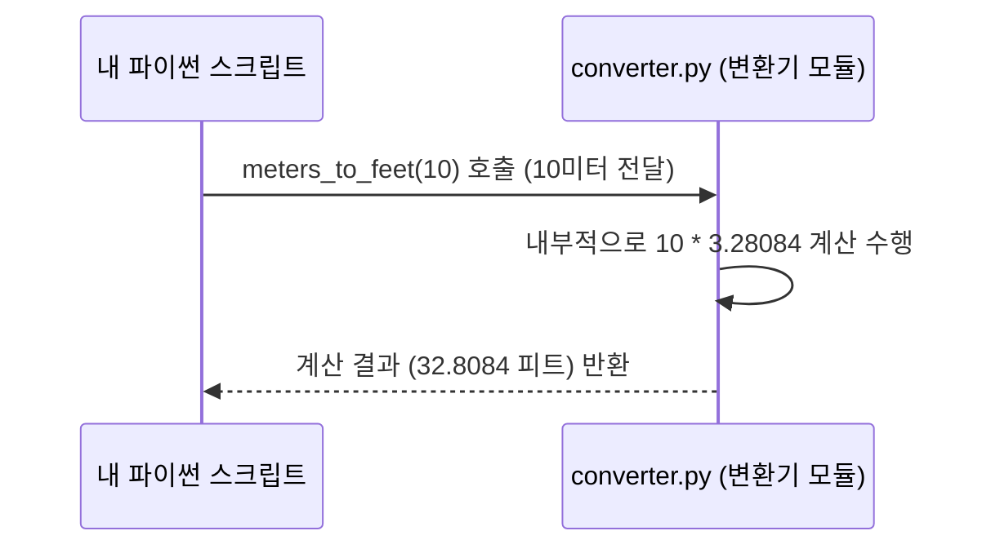

# Chapter 6: 길이 단위 변환 함수


안녕하세요! 이전 장인 [제5장: 온도 단위 변환 함수](05_온도_단위_변환_함수_.md)에서는 섭씨와 화씨 온도를 서로 변환하는 함수들을 살펴보았습니다. 마치 마법의 온도계처럼 말이죠!

이번 장에서는 **길이 단위를 변환하는 함수**들에 대해 자세히 알아볼 거예요. 혹시 해외 쇼핑몰에서 마음에 드는 가구를 봤는데, 크기가 피트(feet)나 인치(inch)로만 표시되어 있어서 실제로 얼마나 큰지 감이 안 왔던 적 있나요? 아니면, 미국 DIY 유튜브 채널을 보는데 모든 재료의 길이가 피트로 설명되어서 미터(meter)로 얼마인지 궁금했던 적은요? 이럴 때 우리 `converter` 모듈의 길이 변환 함수들이 큰 도움을 줄 수 있습니다!

이 함수들은 마치 **줄자의 양면**과 같아요. 한쪽 면에는 미터(m) 눈금이, 다른 쪽 면에는 피트(ft) 눈금이 있어서, 필요에 따라 단위를 바꿔가며 길이를 쉽게 이해할 수 있게 도와줍니다. 특히 국제 규격이나 해외 자료를 다룰 때, 우리나라에서 주로 쓰는 미터법 단위로 통일하거나 외국 단위를 이해하는 데 아주 유용하답니다.

## 길이를 변환하는 두 가지 도구: `meters_to_feet`와 `feet_to_meters`

우리 `converter` 모듈 안에는 길이를 변환하는 두 가지 핵심 함수가 있습니다.

1.  `meters_to_feet(미터)`: 미터(m) 길이를 피트(ft) 길이로 바꿔줍니다.
2.  `feet_to_meters(피트)`: 피트(ft) 길이를 미터(m) 길이로 바꿔줍니다.

함수 이름만 봐도 어떤 일을 하는지 명확하게 알 수 있죠? 이제 각 함수를 어떻게 사용하는지 함께 살펴봅시다.

## 길이 변환 함수 사용법

먼저, 다른 변환 함수들처럼 `converter` 모듈을 우리 코드에서 사용하려면 `import` 문을 사용해야 합니다.

```python
import converter # converter.py 파일의 모든 함수를 사용할 준비 완료!
```

### 1. 미터(m)를 피트(ft)로 바꾸기: `meters_to_feet()`

예를 들어, 방의 길이가 3미터라고 해봅시다. 이 길이를 피트 단위로 알고 싶다면 `meters_to_feet()` 함수를 사용할 수 있습니다.

**사용 예시:**

3미터를 피트로 바꿔봅시다.

```python
import converter

미터_길이 = 3
피트_결과 = converter.meters_to_feet(미터_길이)

print(f"{미터_길이}미터는 약 {피트_결과}피트 입니다.")
```

**출력 결과:**

```
3미터는 약 9.84252피트 입니다.
```

*   `미터_길이 = 3`: 변환하고 싶은 미터 길이를 `미터_길이` 변수에 저장합니다.
*   `피트_결과 = converter.meters_to_feet(미터_길이)`: `converter` 모듈의 `meters_to_feet` 함수를 호출합니다. 괄호 안에 변환하고 싶은 미터 값(`미터_길이`)을 넣어줍니다. 함수는 이 값을 피트로 변환한 뒤, 그 결과를 `피트_결과` 변수에 저장합니다.
*   `print(...)`: 변환된 결과를 알기 쉽게 출력합니다.

### 2. 피트(ft)를 미터(m)로 바꾸기: `feet_to_meters()`

반대로, 해외 직구 사이트에서 본 책상의 높이가 2.5피트라고 나와 있습니다. 우리가 익숙한 미터로는 얼마나 될까요? 이럴 때는 `feet_to_meters()` 함수가 정답입니다.

**사용 예시:**

2.5피트를 미터로 바꿔봅시다.

```python
import converter

피트_길이 = 2.5
미터_결과 = converter.feet_to_meters(피트_길이)

print(f"{피트_길이}피트는 약 {미터_결과}미터 입니다.")
```

**출력 결과:**

```
2.5피트는 약 0.7620000000000001미터 입니다.
```
(출력되는 소수점 자리수는 실행 환경에 따라 조금씩 다를 수 있어요!)

*   `피트_길이 = 2.5`: 변환하고 싶은 피트 길이를 `피트_길이` 변수에 저장합니다.
*   `미터_결과 = converter.feet_to_meters(피트_길이)`: `converter` 모듈의 `feet_to_meters` 함수를 호출하고, 피트 값(`피트_길이`)을 전달합니다. 함수는 이 값을 미터로 변환하여 `미터_결과` 변수에 저장합니다.

정말 쉽죠? 마치 줄자의 한쪽 면에서 길이를 재고, 다른 쪽 면의 눈금을 읽는 것과 똑같아요!

## 함수 내부에서는 무슨 일이 일어날까요? (작동 원리)

우리가 `converter.meters_to_feet(10)`처럼 함수를 호출하면, 컴퓨터는 어떤 과정을 거쳐 결과를 알려줄까요? 간단한 단계로 나누어 살펴봅시다.

1.  **요청 전달**: 우리 코드(예: `main.py` 또는 여러분이 작성 중인 파이썬 파일)가 `converter` 모듈에게 "10미터를 피트로 바꿔줘!"라고 `meters_to_feet(10)` 함수를 통해 요청합니다. 숫자 10이 함수 안으로 전달됩니다.
2.  **변환 상수 사용**: `meters_to_feet` 함수는 내부에 미터를 피트로 바꾸는 데 필요한 변환 상수(약 3.28084)를 가지고 있습니다. 1미터는 약 3.28084피트이기 때문이죠. 전달받은 숫자 10에 이 변환 상수를 곱합니다: `10 * 3.28084 = 32.8084`.
3.  **결과 반환**: 계산된 결과인 `32.8084`를 함수를 호출했던 우리 코드에게 돌려줍니다.
4.  **결과 활용**: 우리 코드는 돌려받은 `32.8084`라는 값을 변수에 저장하거나 화면에 출력하는 등 필요한 곳에 사용합니다.

`feet_to_meters` 함수도 비슷한 방식으로 작동합니다. 다만, 피트를 미터로 바꾸는 변환 상수(1피트 ≈ 0.3048 미터, 또는 1 / 3.28084)를 사용한다는 점이 다릅니다.

이 과정을 간단한 그림으로 표현하면 다음과 같습니다:



## `converter.py` 코드 들여다보기

이제 `converter.py` 파일 안에 이 길이 변환 함수들이 실제로 어떻게 작성되어 있는지 살펴봅시다. 이 함수들은 [제4장: 단위 변환 기능 모음](04_단위_변환_기능_모음_.md)에서 소개된 `converter` 모듈의 일부입니다.

### `meters_to_feet` 함수

```python
# --- File: converter.py ---
# ... (다른 단위 변환 함수들은 여기에 있을 수 있습니다) ...

def meters_to_feet(meters):
    """미터를 피트로 변환합니다."""
    # 1미터는 약 3.28084 피트입니다.
    return meters * 3.28084

# ... (다른 코드 생략) ...
```

*   `def meters_to_feet(meters):`: `meters_to_feet`라는 이름의 함수를 정의합니다. 괄호 안의 `meters`는 함수가 받을 입력값(매개변수)으로, 여기에 미터 단위의 길이가 들어옵니다.
*   `"""미터를 피트로 변환합니다."""`: 이 함수가 어떤 일을 하는지 설명하는 독스트링입니다.
*   `return meters * 3.28084`: 이 부분이 핵심입니다! 입력받은 `meters` 값에 `3.28084` (1미터당 피트 값)를 곱하여 피트 단위로 변환한 후, 그 결과를 `return` 키워드를 통해 함수를 호출한 곳으로 돌려줍니다.

### `feet_to_meters` 함수

```python
# --- File: converter.py ---
# ... (다른 코드 생략) ...

def feet_to_meters(feet):
    """피트를 미터로 변환합니다."""
    # 1피트는 약 0.3048 미터입니다. (또는 1 / 3.28084)
    return feet / 3.28084

# ... (다른 단위 변환 함수들은 여기에 있을 수 있습니다) ...
```

*   `def feet_to_meters(feet):`: `feet_to_meters` 함수를 정의하고, `feet`라는 이름으로 피트 단위의 길이를 입력받습니다.
*   `return feet / 3.28084`: 입력받은 `feet` 값을 `3.28084`로 나누어 미터 단위로 변환합니다. (`1 / 3.28084`는 약 `0.3048`이므로, `feet * 0.3048`과 거의 같은 결과를 줍니다.) 변환된 미터 값을 반환합니다.

이렇게 각 함수는 정확한 변환 상수를 사용하여 길이를 한 단위에서 다른 단위로 바꿔줍니다.

## 왜 두 개의 함수로 나누어져 있을까요?

미터를 피트로, 피트를 미터로 바꾸는 작업은 서로 다른 방향의 변환입니다. 마치 온도 변환 함수처럼, 각 변환 방향마다 별도의 함수를 만들어 두었습니다.

*   **명확성**: `meters_to_feet`는 미터에서 피트로, `feet_to_meters`는 피트에서 미터로 변환한다는 점이 함수 이름에서부터 명확하게 드러납니다.
*   **단순함**: 각 함수는 하나의 변환 작업에만 집중하므로 코드가 단순하고 이해하기 쉽습니다.
*   **사용 편의성**: 필요한 변환 방향에 맞는 함수를 골라서 사용하기 편리합니다. 마치 줄자의 원하는 눈금 면을 선택하는 것처럼요!

## 정리 및 다음 단계

이번 장에서는 `converter` 모듈 안에 있는 두 가지 유용한 **길이 단위 변환 함수**에 대해 배웠습니다.

*   `meters_to_feet(미터)`: 미터 길이를 피트 길이로 변환합니다.
*   `feet_to_meters(피트)`: 피트 길이를 미터 길이로 변환합니다.

이 함수들을 어떻게 사용하는지, 그리고 내부적으로 어떤 변환 상수를 통해 길이가 변환되는지 살펴보았습니다. 이제 여러분은 해외 자료를 보거나 국제적인 프로젝트를 진행할 때 길이 단위를 손쉽게 변환하여 이해하고 활용할 수 있게 되었습니다!

온도와 길이에 이어, 다음 장에서는 또 다른 중요한 단위인 무게를 변환하는 함수들에 대해 알아볼 것입니다. 킬로그램(kg)과 파운드(lb) 사이를 자유롭게 오가는 방법을 배우게 될 거예요!

➡️ [다음 장: 무게 단위 변환 함수](07_무게_단위_변환_함수_.md)

---

Generated by [AI Codebase Knowledge Builder](https://github.com/The-Pocket/Tutorial-Codebase-Knowledge)