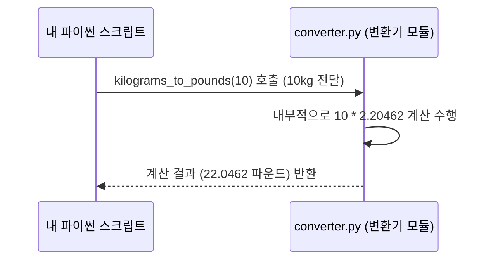

# Chapter 7: 무게 단위 변환 함수


안녕하세요! 이전 장인 [제6장: 길이 단위 변환 함수](06_길이_단위_변환_함수_.md)에서는 미터와 피트 사이를 자유롭게 오가는 길이 변환 함수들을 살펴보았습니다. 마치 마법의 양면 줄자 같았죠!

이번 장에서는 **무게 단위를 변환하는 함수**들에 대해 자세히 알아볼 거예요. 해외 식료품점에서 치즈나 고기를 사려는데 무게가 파운드(pounds, lb)로만 적혀 있어서 킬로그램(kilograms, kg)으로는 얼마나 되는지 궁금했던 적 있으신가요? 또는, 헬스장에서 사용하는 원판의 무게가 파운드로 표시되어 있어서 킬로그램으로 환산하고 싶을 때도 있죠. 바로 이런 상황에서 우리 `converter` 모듈의 무게 변환 함수들이 아주 유용하게 사용될 수 있습니다!

이 함수들은 마치 **여러 단위로 무게를 보여주는 똑똑한 저울**과 같아요. 킬로그램으로도, 파운드로도 무게를 쉽게 확인할 수 있게 도와주죠. 덕분에 우리는 해외 레시피를 따르거나, 운동 계획을 세울 때, 또는 다양한 무게 정보를 다룰 때 혼란 없이 원하는 단위로 무게를 파악할 수 있습니다.

## 무게를 변환하는 두 가지 전문가: `kilograms_to_pounds`와 `pounds_to_kilograms`

우리 [제4장: 단위 변환 기능 모음](04_단위_변환_기능_모음_.md)에서 소개된 `converter` 모듈 안에는 무게를 변환하는 두 가지 주요 함수가 있습니다.

1.  `kilograms_to_pounds(킬로그램)`: 킬로그램(kg) 무게를 파운드(lb) 무게로 바꿔줍니다.
2.  `pounds_to_kilograms(파운드)`: 파운드(lb) 무게를 킬로그램(kg) 무게로 바꿔줍니다.

함수 이름만 봐도 어떤 일을 하는지 바로 알 수 있겠죠? 이제 각 함수를 어떻게 사용하는지 함께 살펴봅시다.

## 무게 변환 함수 사용법

다른 변환 함수들과 마찬가지로, `converter` 모듈을 우리 코드에서 사용하려면 먼저 `import` 문을 사용해야 합니다.

```python
import converter # converter.py 파일의 모든 함수를 사용할 준비 완료!
```

### 1. 킬로그램(kg)을 파운드(lb)로 바꾸기: `kilograms_to_pounds()`

예를 들어, 5킬로그램짜리 쌀 한 포대를 샀다고 해봅시다. 이 무게를 파운드 단위로 알고 싶다면 `kilograms_to_pounds()` 함수를 사용하면 됩니다.

**사용 예시:**

5킬로그램을 파운드로 바꿔봅시다.

```python
import converter

킬로그램_무게 = 5
파운드_결과 = converter.kilograms_to_pounds(킬로그램_무게)

print(f"{킬로그램_무게}kg은(는) 약 {파운드_결과}파운드 입니다.")
```

**출력 결과:**

```
5kg은(는) 약 11.0231파운드 입니다.
```

*   `킬로그램_무게 = 5`: 변환하고 싶은 킬로그램 무게를 `킬로그램_무게` 변수에 저장합니다.
*   `파운드_결과 = converter.kilograms_to_pounds(킬로그램_무게)`: `converter` 모듈의 `kilograms_to_pounds` 함수를 호출합니다. 괄호 안에 변환하고 싶은 킬로그램 값(`킬로그램_무게`)을 넣어줍니다. 함수는 이 값을 파운드로 변환한 뒤, 그 결과를 `파운드_결과` 변수에 저장합니다.
*   `print(...)`: 변환된 결과를 알기 쉽게 출력합니다.

### 2. 파운드(lb)를 킬로그램(kg)으로 바꾸기: `pounds_to_kilograms()`

반대로, 해외 운동 유튜브 채널에서 본 덤벨의 무게가 20파운드라고 합니다. 우리가 익숙한 킬로그램으로는 얼마나 될까요? 이럴 때는 `pounds_to_kilograms()` 함수가 정답입니다.

**사용 예시:**

20파운드를 킬로그램으로 바꿔봅시다.

```python
import converter

파운드_무게 = 20
킬로그램_결과 = converter.pounds_to_kilograms(파운드_무게)

print(f"{파운드_무게}파운드는 약 {킬로그램_결과}kg 입니다.")
```

**출력 결과:**

```
20파운드는 약 9.071858199053991kg 입니다.
```
(출력되는 소수점 자리수는 실행 환경에 따라 조금씩 다를 수 있어요!)

*   `파운드_무게 = 20`: 변환하고 싶은 파운드 무게를 `파운드_무게` 변수에 저장합니다.
*   `킬로그램_결과 = converter.pounds_to_kilograms(파운드_무게)`: `converter` 모듈의 `pounds_to_kilograms` 함수를 호출하고, 파운드 값(`파운드_무게`)을 전달합니다. 함수는 이 값을 킬로그램으로 변환하여 `킬로그램_결과` 변수에 저장합니다.

정말 간단하죠? 마치 저울 위에서 단위를 바꾸는 버튼을 누르는 것처럼 편리하게 무게를 변환할 수 있습니다!

## 함수 내부에서는 무슨 일이 일어날까요? (작동 원리)

우리가 `converter.kilograms_to_pounds(10)`처럼 함수를 호출하면, 컴퓨터는 어떤 과정을 거쳐 결과를 알려줄까요? 간단한 단계로 나누어 살펴봅시다.

1.  **요청 전달**: 우리 코드(예: `main.py` 또는 여러분이 작성 중인 파이썬 파일)가 `converter` 모듈에게 "10킬로그램을 파운드로 바꿔줘!"라고 `kilograms_to_pounds(10)` 함수를 통해 요청합니다. 숫자 10이 함수 안으로 전달됩니다.
2.  **변환 상수 사용**: `kilograms_to_pounds` 함수는 내부에 킬로그램을 파운드로 바꾸는 데 필요한 변환 상수(약 2.20462)를 가지고 있습니다. 1킬로그램은 약 2.20462파운드이기 때문이죠. 전달받은 숫자 10에 이 변환 상수를 곱합니다: `10 * 2.20462 = 22.0462`.
3.  **결과 반환**: 계산된 결과인 `22.0462`를 함수를 호출했던 우리 코드에게 돌려줍니다.
4.  **결과 활용**: 우리 코드는 돌려받은 `22.0462`라는 값을 변수에 저장하거나 화면에 출력하는 등 필요한 곳에 사용합니다.

`pounds_to_kilograms` 함수도 비슷한 방식으로 작동합니다. 다만, 파운드를 킬로그램으로 바꾸는 변환 상수(1파운드 ≈ 0.453592 킬로그램, 또는 1 / 2.20462)를 사용한다는 점이 다릅니다.

이 과정을 간단한 그림으로 표현하면 다음과 같습니다:



## `converter.py` 코드 들여다보기

이제 `converter.py` 파일 안에 이 무게 변환 함수들이 실제로 어떻게 작성되어 있는지 살펴봅시다.

### `kilograms_to_pounds` 함수

```python
# --- File: converter.py ---
# ... (다른 단위 변환 함수들은 여기에 있을 수 있습니다) ...

def kilograms_to_pounds(kg):
    """킬로그램을 파운드로 변환합니다."""
    # 1킬로그램은 약 2.20462 파운드입니다.
    return kg * 2.20462

# ... (다른 코드 생략) ...
```

*   `def kilograms_to_pounds(kg):`: `kilograms_to_pounds`라는 이름의 함수를 정의합니다. 괄호 안의 `kg`는 함수가 받을 입력값(매개변수)으로, 여기에 킬로그램 단위의 무게가 들어옵니다.
*   `"""킬로그램을 파운드로 변환합니다."""`: 이 함수가 어떤 일을 하는지 설명하는 독스트링입니다.
*   `return kg * 2.20462`: 이 부분이 핵심입니다! 입력받은 `kg` 값에 `2.20462` (1킬로그램당 파운드 값)를 곱하여 파운드 단위로 변환한 후, 그 결과를 `return` 키워드를 통해 함수를 호출한 곳으로 돌려줍니다.

### `pounds_to_kilograms` 함수

```python
# --- File: converter.py ---
# ... (다른 코드 생략) ...

def pounds_to_kilograms(pounds):
    """파운드를 킬로그램으로 변환합니다."""
    # 1파운드는 약 0.453592 킬로그램입니다. (또는 1 / 2.20462)
    return pounds / 2.20462

# ... (다른 단위 변환 함수들은 여기에 있을 수 있습니다) ...
```

*   `def pounds_to_kilograms(pounds):`: `pounds_to_kilograms` 함수를 정의하고, `pounds`라는 이름으로 파운드 단위의 무게를 입력받습니다.
*   `return pounds / 2.20462`: 입력받은 `pounds` 값을 `2.20462`로 나누어 킬로그램 단위로 변환합니다. (`1 / 2.20462`는 약 `0.453592`이므로, `pounds * 0.45359237`과 거의 같은 결과를 줍니다.) 변환된 킬로그램 값을 반환합니다.

이렇게 각 함수는 정확한 변환 상수를 사용하여 무게를 한 단위에서 다른 단위로 알맞게 바꿔줍니다.

## 왜 두 개의 함수로 나누어져 있을까요?

킬로그램을 파운드로, 파운드를 킬로그램으로 바꾸는 작업은 서로 다른 방향의 변환입니다. 온도나 길이 변환 함수들처럼, 각 변환 방향마다 별도의 함수를 만들어 두었습니다.

*   **명확성**: `kilograms_to_pounds`는 킬로그램에서 파운드로, `pounds_to_kilograms`는 파운드에서 킬로그램으로 변환한다는 점이 함수 이름에서부터 명확하게 드러납니다.
*   **단순함**: 각 함수는 하나의 변환 작업에만 집중하므로 코드가 단순하고 이해하기 쉽습니다.
*   **사용 편의성**: 필요한 변환 방향에 맞는 함수를 골라서 사용하기 편리합니다. 마치 저울에서 원하는 단위 버튼을 누르는 것처럼요!

## 정리

이번 장에서는 `converter` 모듈 안에 있는 두 가지 유용한 **무게 단위 변환 함수**에 대해 배웠습니다.

*   `kilograms_to_pounds(킬로그램)`: 킬로그램 무게를 파운드 무게로 변환합니다.
*   `pounds_to_kilograms(파운드)`: 파운드 무게를 킬로그램 무게로 변환합니다.

이 함수들을 어떻게 사용하는지, 그리고 내부적으로 어떤 변환 상수를 통해 무게가 변환되는지 살펴보았습니다. 이제 여러분은 해외 식료품을 구매하거나 운동 관련 무게를 확인할 때, 또는 다양한 무게 정보를 다룰 때 단위 변환을 손쉽게 할 수 있게 되었습니다!

이것으로 우리 `example_code` 프로젝트의 `converter` 모듈에 있는 주요 단위 변환 함수들에 대한 탐험을 마칩니다. 여러분은 이제 온도, 길이, 그리고 무게까지 다양한 단위를 필요에 따라 변환하는 방법을 알게 되었습니다. 축하합니다!

---

Generated by [AI Codebase Knowledge Builder](https://github.com/The-Pocket/Tutorial-Codebase-Knowledge)