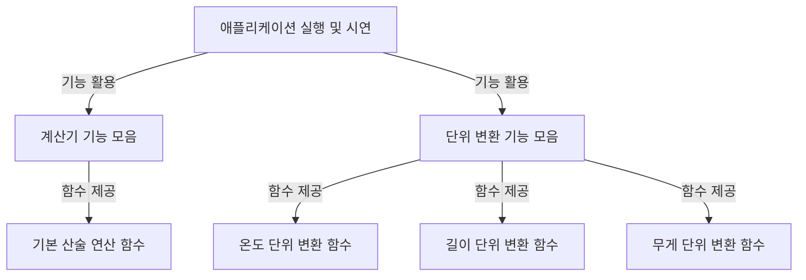

# Tutorial: example_code

이 프로젝트는 **기본적인 수학 계산**과 다양한 *단위 변환* 기능을 제공하는 간단한 애플리케이션입니다.
사용자는 이 프로그램을 통해 덧셈, 뺄셈과 같은 사칙연산뿐만 아니라, 온도, 길이, 무게 단위도 손쉽게 변환할 수 있습니다.
마치 다기능 계산기와 단위 변환기를 하나로 합쳐놓은 것과 같습니다.

**Source Repository:** [None](None)

## Chapters

1. [애플리케이션 실행 및 시연
](01_애플리케이션_실행_및_시연_.md)
2. [계산기 기능 모음
](02_계산기_기능_모음_.md)
3. [기본 산술 연산 함수
](03_기본_산술_연산_함수_.md)
4. [단위 변환 기능 모음
](04_단위_변환_기능_모음_.md)
5. [온도 단위 변환 함수
](05_온도_단위_변환_함수_.md)
6. [길이 단위 변환 함수
](06_길이_단위_변환_함수_.md)
7. [무게 단위 변환 함수
](07_무게_단위_변환_함수_.md)

---

Generated by [AI Codebase Knowledge Builder](https://github.com/The-Pocket/Tutorial-Codebase-Knowledge)