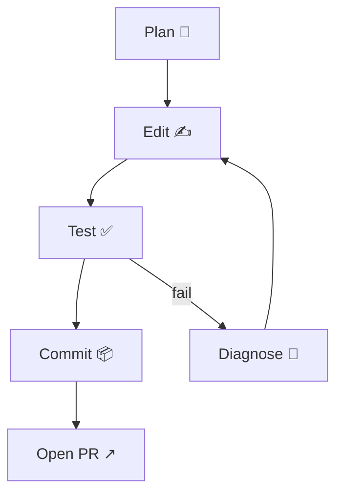

# workflow\_state.md

> **Purpose**  This document defines the canonical workflow contract for **Palantir** repository automation. It is consumed by two autonomous agents:
>
> 1. **Cursor AI Agent Mode** – local development loop (planning ▸ editing ▸ testing ▸ committing)
> 2. **Codex Sidebar** – cloud sandbox executor for off‑loaded tasks (small, isolated PRs)
>
> Keep this file in the project root. Agents must re‑read the file whenever it changes.

---

## 1. Repository Zones

| Zone          | Path(s)                           | Permissions                  | Notes                                                                   |
| ------------- | --------------------------------- | ---------------------------- | ----------------------------------------------------------------------- |
| **Read‑Only** | `docs/`, `.git/`, `tests/legacy/` | 🔒 No edits                  | Docs generated from upstream sources. Update via `script/sync_docs.sh`. |
| **Generated** | `dist/`, `dash_app/assets/`       | 🛑 Never commit manual edits | Built via `make build` or CI.                                           |
| **Mutable**   | the rest                          | ✍️ Allowed                   | Main development area.                                                  |

Cursor Agent must refuse modifications outside **Mutable** paths unless patch is explicitly labelled `--force`.

## 2. Branch & Commit Policy

* **Feature branches**: `feat/<ticket>‑<slug>`
* **Codex tasks**: `codex/<task‑slug>` (auto‑named by Sidebar)
* **Hotfix**: `fix/<issue‑id>`

Commits must be Conventional Commits style (`type(scope): subject`). Cursor auto‑format with `git cz`.

## 3. Environment Bootstrap

```bash
make env       # ⇢ python -m venv .venv && pip install -r requirements.txt
make lint      # ⇢ ruff . && black --check .
make test      # ⇢ pytest -q
make compose   # ⇢ docker compose up -d airflow duckdb neo4j
```

Agents must call **all** four targets before opening a PR. Fail‑fast if any step exits non‑zero.

## 4. Test Suites

* **Unit tests** live in `tests/unit/`
* **Integration** in `tests/integration/` – require Docker services
* **Smoke** scripts (`scripts/smoke_*.py`) run in CI after build

Mark slow tests with `@pytest.mark.slow`; Cursor Agent skips them via `pytest -m "not slow"` during rapid loops.

## 5. Lint & Formatting Rules

* `ruff` error‑only, no warnings
* `black` line‑length = 100
* `isort` profile = black

Patch fails if lint fails. Codex must include a separate "Apply formatter" commit when diff > 300 LoC.

## 6. Secrets & Config

| Variable            | Description            | Scope                        |
| ------------------- | ---------------------- | ---------------------------- |
| `CURSOR_API_KEY`    | Cursor cloud agent key | local only                   |
| `ANTHROPIC_API_KEY` | optional Claude usage  | local / CI secrets           |
| `ONEDRIVE_*`        | Graph credentials      | local only, mount via `.env` |

Secrets never committed. `.env.example` contains placeholders. CI uses repo‑level secrets.

## 7. Cursor Agent Loop



* `plan` phase must include a checklist referencing acceptance criteria.
* `edit` uses VS Code API (`edit` cmds) only within **Mutable** paths.
* `diagnose` summarises stack‑traces in 5 lines max.
* loop terminates when `pytest -q` green **and** lint passes.

## 8. Codex Task Lifecycle

1. **Task** created with *Branch*, *Prompt*, *Files*, *Tests* declared.
2. Codex runs in sandbox clone (depth 1) → opens PR.
3. CI on PR triggers **make env lint test**.
4. Human review → squash‑merge.

Codex must limit patch ≤ 500 LoC. If larger, split into sequential tasks.

## 9. Retry & Timeout

| Action            | Max Retries | Back‑off     |
| ----------------- | ----------- | ------------ |
| Cursor test loop  | 3           | +30 s each   |
| Codex sandbox run | 2           | fixed 15 min |

Cursor aborts task after three failed loops and raises `/tmp/agent_fail.log`.

## 10. Known Pitfalls & Guards

* **Windows line endings** – enforce LF: `git config --local core.autocrlf input`
* **Neo4j bolt URI** must be `bolt://neo4j:7687` (Docker names)
* **Airflow v2.10** image includes Python 3.9; pin libs accordingly.

## 11. Changelog Workflow

* Update `CHANGELOG.md` via `cz bump --prerelease alpha` on each merge to `main`.
* CI pushes tag `vX.Y.Z‑alpha.<sha>` to `ghcr.io` Docker registry.

## 12. Contribution Summary Stub

Every PR description must end with `<!-- summary -->` block:

```markdown
### Summary
* Added …
* Fixed …
* Docs …
```

Cursor Agent auto‑populates this via commit script `scripts/gen_summary.py`.

---

*Last updated: 2025‑05‑19 by ChatGPT workflow generator.*
